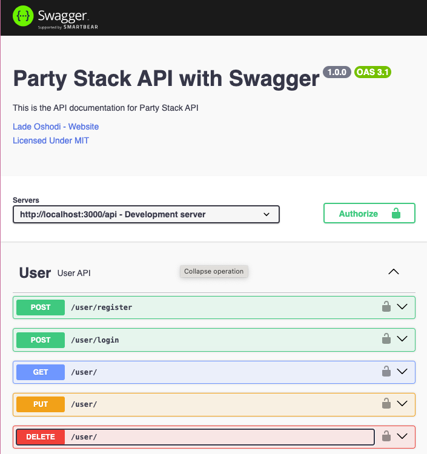

# Party Stack API

##### An online repository of indoor party games

## Overview

This project was developed independently over the course of one week, utilizing a ReactJS frontend and a Node.js/Express backend.

#### Visit the Documentation

Development: [Party Stack API (Swagger)](http://localhost:3000/api-docs/) (LocalHost)
Production: [Party Stack API (Swagger)](https://party-stack-api.netlify.app/api-docs/) [coming soon ...]

## Technologies

- TypeScript
- Express
- JWT
- Bcrypt
- Jest
- Supertest

_You can find the [frontend deployment here](https://github.com/ladeoshodi/party-stack-fe)_
